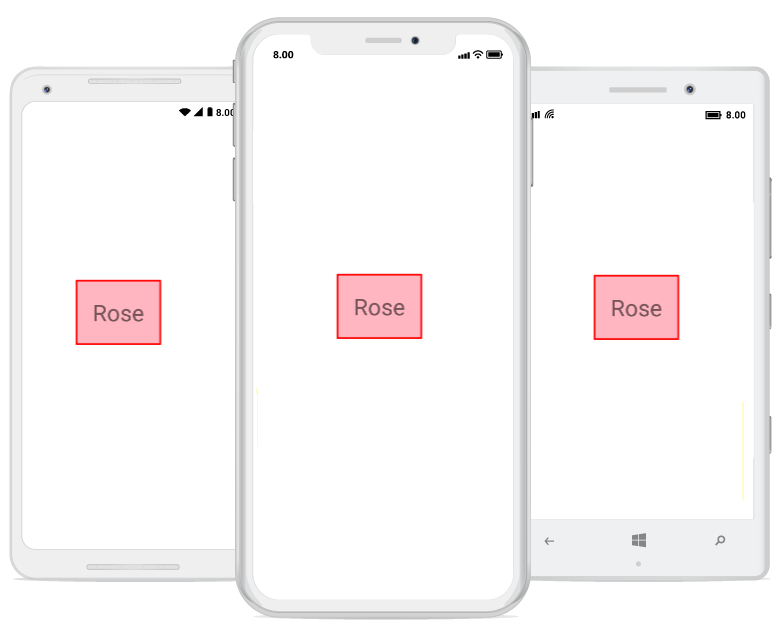

# Getting Started for Xamarin.Forms SfBorder
This is demo application of Xamarin.Forms SfBorder control. The minimal set of required properties have been configured in this project to get started with SfBorder in Xamarin.Forms.

For more details please refer the Xamarin.Forms SfBorder UG documentation [Getting Started](https://help.syncfusion.com/xamarin/border/getting-started) link.

## <a name="requirements-to-run-the-demo"></a>Requirements to run the demo ##

* [Visual Studio 2019 or Visual Studio 2017](https://visualstudio.microsoft.com/downloads/) or [Visual Studio for Mac](https://visualstudio.microsoft.com/vs/mac/).
* Xamarin add-ons for Visual Studio (available via the Visual Studio installer).

## <a name="troubleshooting"></a>Troubleshooting ##
### Path too long exception
If you are facing path too long exception when building this example project, close Visual Studio and rename the repository to short and build the project.

## <a name="description"></a>Description ##

### Initialize SfBorder

Import the [`SfBorder`](https://help.syncfusion.com/cr/xamarin/Syncfusion.XForms.Border.html) namespace as shown below in your respective Page,

###### Xaml
```xaml
xmlns:border="clr-namespace:Syncfusion.XForms.Border;assembly=Syncfusion.Core.XForms"
```
###### C#
```C#
using Syncfusion.XForms.Border;
```

The [`SfBorder`](https://help.syncfusion.com/cr/xamarin/Syncfusion.XForms.Border.html) control is configured entirely in C# code or in XAML markup. The following steps explain how to create a [`SfBorder`](https://help.syncfusion.com/cr/xamarin/Syncfusion.XForms.Border.html) and configure its elements.


###### Xaml
```xaml
<Grid>
<border:SfBorder 
   BorderColor="Red"
   BackgroundColor="#ffb6c1" 
   HorizontalOptions="Center" 
   VerticalOptions="Center"
   BorderWidth="3">
<Label 
  Text="Rose" 
  Margin="10" 
  Font="15"  />
</border:SfBorder>
</Grid>
```
###### C#
```C#
using System;
using Syncfusion.XForms.Border;
using Xamarin.Forms;

namespace BorderGettingStarted
{
    public partial class MainPage : ContentPage
    {
        public MainPage()
        {
            InitializeComponent();

            Grid mainGrid = new Grid();

            // Create Border control
            SfBorder border = new SfBorder();
            border.VerticalOptions = LayoutOptions.Center;
            border.HorizontalOptions = LayoutOptions.Center;
            border.BorderColor = Color.Red;
            border.BackgroundColor = Color.FromHex("#ffb6c1");

            //Create Label control
            Label label = new Label();
            label.Text = "Rose";
            label.FontSize = 15;

            border.Content = label;
            mainGrid.Children.Add(border);
            this.Content = mainGrid;
        }
    }
}
```

## <a name="output"></a>Output ##


